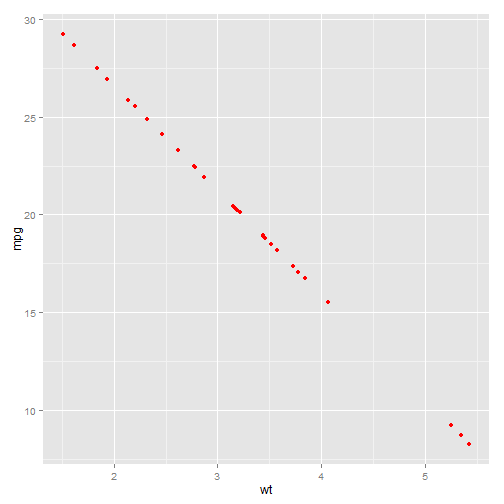

<style type="text/css">
.small-code pre code {
   font-size: 1.1em;
}
</style>


Introduction to Reproducible Research (Demo)
========================================================
author: Andrey Koval
date: October 10, 2014

The Laboratory for Integrative Lifespan Research   
Department of Psychology  
University of Victoria  


Traditional research workflow
========================================================
  
  


Reproducible research workflow
========================================================
    
as compared to traditional:  
  


Advantages of RR
========================================================
    

- Less prone to human error  
- Removes tedious jobs  
- Recordable workflow  
- Correcting mistakes later  
- Removes cognitive strain to synchronize analysis and discussion  

TOOLBOX and toolset of RR
========================================================
  
 - R
 - RStudio
 - GitHub
 - git
 
 toolbox and TOOLSET of RR
========================================================
  
 - Data Manipulation  
 - Graph Production  
 - Statistical Modeling  
 - Dynamic Reporting  


Goals of RR
========================================================
    
**Ultimate** : Answering a research question  
**Practical** : Publishing a paper, producing a manuscript  
**Technical** : Producing a dynamic document   


RR uses code to
========================================================
  
In the process of achieving these goals we encounter the need to perform particular tasks in some computer environment:

1. Load and inspect datasets  
2. Depict data in statistical graphics  
3. Fit statistical models  
4. Compare observed and modeled data  
5. Produce reports discussing the steps above  

1. Load and inspect datasets
========================================================

```r
ds <- mtcars
head(ds, 10)
```

```
                   mpg cyl  disp  hp drat    wt  qsec vs am gear carb
Mazda RX4         21.0   6 160.0 110 3.90 2.620 16.46  0  1    4    4
Mazda RX4 Wag     21.0   6 160.0 110 3.90 2.875 17.02  0  1    4    4
Datsun 710        22.8   4 108.0  93 3.85 2.320 18.61  1  1    4    1
Hornet 4 Drive    21.4   6 258.0 110 3.08 3.215 19.44  1  0    3    1
Hornet Sportabout 18.7   8 360.0 175 3.15 3.440 17.02  0  0    3    2
Valiant           18.1   6 225.0 105 2.76 3.460 20.22  1  0    3    1
Duster 360        14.3   8 360.0 245 3.21 3.570 15.84  0  0    3    4
Merc 240D         24.4   4 146.7  62 3.69 3.190 20.00  1  0    4    2
Merc 230          22.8   4 140.8  95 3.92 3.150 22.90  1  0    4    2
Merc 280          19.2   6 167.6 123 3.92 3.440 18.30  1  0    4    4
```


2) Depict data as statistical graphics
========================================================

```r
require(ggplot2)
ggplot(mtcars, aes(x=wt, y=mpg)) + geom_point()
```

 

3) Fit statistical models
========================================================

```r
lm(mpg ~ wt, mtcars)
```

```

Call:
lm(formula = mpg ~ wt, data = mtcars)

Coefficients:
(Intercept)           wt  
      37.29        -5.34  
```

4) Compare observed and modeled data
========================================================

```r
require(ggplot2)
ds <- mtcars
ds$mpg_modeled <- predict(lm(mpg ~ wt, mtcars))
p <- ggplot(ds, aes(x=wt, y=mpg)) 
p <- p + geom_point() 
p <- p + geom_line(aes(y=mpg_modeled),color="red")
p
```

 

5) Produce reports 
========================================================
that discuss this comparision and verbalize the conclusions that can be drawn from the analysis
 

